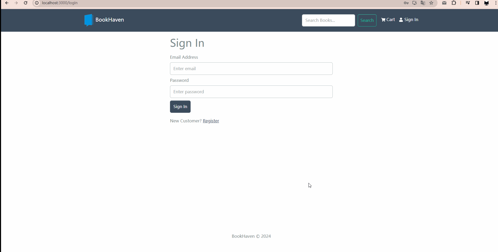

# E-Commerce Bookstore Application

## Description

This application is a full-featured e-commerce bookstore complete with AI recommendations, user authentication, and an admin dashboard for comprehensive management of the bookstore's operations.




## Features

- Full-featured shopping cart
- Product reviews and ratings
- Carousel for top products
- Pagination for product listings
- Search functionality for products
- User profiles with order history
- Admin management of products, users, and orders
- Detailed admin order page
- Option to mark orders as delivered
- Checkout process with shipping and payment method selection
- PayPal and credit card integration
- Database seeder for products and users

## Environment Setup

Create a `.env` file in the root directory and add the following:

```
NODE_ENV=development 
PORT=5000 MONGO_URI=your_mongodb_uri 
JWT_SECRET=‘abc123’ 
PAYPAL_CLIENT_ID=your_paypal_client_id 
PAGINATION_LIMIT=8
```


Change `JWT_SECRET` and `PAGINATION_LIMIT` as desired.

## Installation

Install dependencies for both frontend and backend:

```bash
npm install
cd frontend
npm install
```

## Running the Application

Run both frontend and backend:
```
npm run dev
```
Run backend only:
```
npm run server
```

## Build & Deploy
Create a production build for the frontend:
```
cd frontend
npm run build
```

## Seed Database
Use these commands to seed or destroy data in the database:
```
# Import data
npm run data:import

# Destroy data
npm run data:destroy
```

## Sample User Logins
- Admin: admin@email.com | Password: 123456
- Customer: john@email.com | Password: 123456
- Customer: jane@email.com | Password: 123456

## License

This project is licensed under the MIT License.
